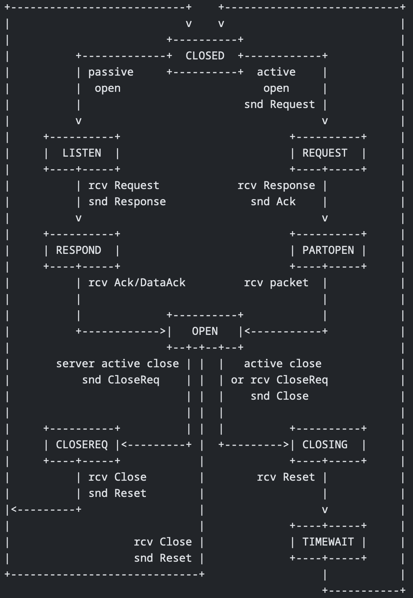

<!-- Em progresso -->

# Eventos e Checksum

Esta seção descreve como as conexões DCCP transitam entre estados e quais pacotes são enviados quando. Note que a negociação de recursos ocorre em paralelo com as transições de estado em toda a conexão descritas aqui.

## Eventos

### Estabelecimento de conexão

A fase de inicialização das conexões DCCP consiste em um handshake de três vias: um pacote DCCP-Request inicial enviado pelo cliente, um DCCP-Response enviado pelo servidor em resposta e, finalmente, um reconhecimento do cliente, geralmente através de um pacote DCCP-Ack ou DCCP-DataAck. O cliente move-se do estado REQUEST para PARTOPEN e, finalmente, para OPEN. O servidor move-se de LISTEN para RESPOND e, finalmente, para OPEN.

| Estado do Cliente | Estado do Servidor      |
| ----------------- | ----------------------- |
| CLOSED            | LISTEN                  |
| REQUEST   -->     | Request        -->      |
|                   | Response       <--      | RESPOND |
| PARTOPEN  -->     | Ack, DataAck     -->    |
|                   | Data, Ack, DataAck  <-- | OPEN    |
| OPEN      <->     | Data, Ack, DataAck  <-> | OPEN    |

#### Requisição do cliente

Quando um cliente decide iniciar uma conexão, ele entra no estado de REQUEST, escolhe um número de sequência inicial e envia um pacote DCCP-Request para o servidor pretendido usando esse número de sequência. Esses pacotes DCCP-Request geralmente contêm opções de negociação de recursos que iniciam negociações para vários parâmetros de conexão, como IDs de controle de congestionamento preferenciais para cada meia-conexão. Além disso, eles podem transportar dados de aplicativos, mas o cliente deve estar ciente de que o servidor pode não aceitar esses dados.

Um cliente no estado de REQUEST deve usar um temporizador de espera exponencial para enviar novos pacotes DCCP-Request se não receber resposta. As retransmissões devem começar aproximadamente após um segundo, com intervalos aumentando para não menos que um pacote a cada 64 segundos, seguindo uma estratégia de retransmissão semelhante à dos TCP SYNs. O cliente pode desistir de seus DCCP-Requests após algum tempo (por exemplo, 3 minutos) e, nesse caso, deve enviar um pacote DCCP-Reset para o servidor com código de reset 2, "Abortado", para limpar o estado caso uma ou mais das solicitações realmente tenham chegado. Ao receber um DCCP-Response do servidor, o cliente deixa o estado de REQUEST e entra no estado de PARTOPEN.

#### Resposta do servidor

Na segunda fase do handshake de três vias, o servidor transita do estado LISTEN para RESPOND e envia uma mensagem DCCP-Response ao cliente. Nesta fase, o servidor geralmente especifica as funcionalidades que gostaria de usar, tanto das solicitadas pelo cliente quanto adicionais. Entre essas opções está o mecanismo de controle de congestionamento que o servidor pretende utilizar. O servidor pode responder a um pacote DCCP-Request com um pacote DCCP-Reset para recusar a conexão, utilizando códigos de reset relevantes como "Conexão Recusada", "Código de Serviço Inválido" ou "Servidor Ocupado".

O servidor não deve retransmitir pacotes DCCP-Response; o cliente fará a retransmissão do DCCP-Request, se necessário. O servidor detectará que o DCCP-Request retransmitido se aplica a uma conexão existente devido às suas portas de origem e destino. Cada DCCP-Request válido recebido enquanto o servidor estiver no estado RESPOND deve elicitar um novo DCCP-Response. O servidor sai do estado RESPOND para OPEN quando recebe um DCCP-Ack válido do cliente, concluindo o handshake de três vias, ou para CLOSED após um timeout, enviando um DCCP-Reset para limpar o estado no cliente.

#### Finalização do handshake

Quando o cliente recebe um DCCP-Response do servidor, ele transita do estado de REQUEST para PARTOPEN e completa o handshake de três vias enviando um pacote DCCP-Ack para o servidor. Permanece em PARTOPEN até ter certeza de que o servidor recebeu algum pacote enviado pelo cliente a partir de PARTOPEN (seja o DCCP-Ack inicial ou um pacote posterior). Clientes no estado PARTOPEN que desejam enviar dados devem fazê-lo usando pacotes DCCP-DataAck, não DCCP-Data, pois estes últimos não contêm números de reconhecimento, tornando impossível para o servidor saber se o cliente recebeu o DCCP-Response. Além disso, se o DCCP-Response incluir um Init Cookie, esse Init Cookie deve ser incluído em cada pacote enviado em PARTOPEN.

> Um Init Cookie é uma opção utilizada pelo servidor DCCP para evitar a necessidade de manter qualquer estado até que o handshake de configuração da conexão de três vias seja concluído, semelhante ao conceito de TCP SYN cookies. Ele encapsula informações importantes da solicitação (DCCP-Request) e resposta (DCCP-Response) em um cookie opaco, como código de serviço, porta do servidor e opções relevantes, sendo tipicamente criptografado com uma chave secreta do servidor. Quando o servidor recebe o cookie de volta na resposta, pode decifrá-lo e instanciar todo o estado necessário para a conexão.

O único DCCP-Ack enviado ao entrar no estado PARTOPEN pode ser perdido pela rede. O cliente deve garantir que algum pacote seja eventualmente entregue. Um mecanismo preferencial seria um temporizador de aproximadamente 200 milissegundos, acionado sempre que um pacote é transmitido em PARTOPEN. Se esse temporizador expirar e o cliente ainda estiver em PARTOPEN, ele gera outro DCCP-Ack e ajusta o temporizador. Se o cliente permanecer em PARTOPEN por mais de 4MSL (8 minutos), deve redefinir a conexão com o código de reset 2, "Abortado". O cliente sai do estado PARTOPEN para OPEN ao receber um pacote válido diferente de DCCP-Response, DCCP-Reset ou DCCP-Sync do servidor.

#### Códigos de serviço

Cada DCCP-Request contém um Service Code de 32 bits, que identifica o serviço de nível de aplicativo ao qual a aplicação do cliente está tentando se conectar. Esses códigos devem corresponder a serviços e protocolos de aplicativos específicos, como por exemplo, um código para conexões de controle [SIP](https://ozekiphone.com/p_4397-rtp-vs.-sip.html/) e outro para conexões de áudio [RTP](https://ozekiphone.com/p_4397-rtp-vs.-sip.html). Os middleboxes, como firewalls, podem usar o Service Code para identificar a aplicação em execução em uma porta não padrão, desde que o cabeçalho DCCP não tenha sido criptografado. É obrigatório que cada socket DCCP, tanto aberto ativamente quanto passivamente, esteja associado a um Service Code, sendo que o aplicativo geralmente fornecerá esse código. Sockets ativos devem ter exatamente um Service Code, enquanto sockets passivos podem, a critério da implementação, estar associados a mais de um Service Code para permitir que múltiplas aplicações ou versões diferentes da mesma aplicação escutem na mesma porta, diferenciadas pelo Service Code.

Se o Service Code do DCCP-Request não corresponder a nenhum dos Service Codes do servidor para a porta especificada, o servidor deve rejeitar a solicitação enviando um pacote DCCP-Reset com Reset Code 8, "Bad Service Code". Middleboxes também podem enviar tal DCCP-Reset em resposta a pacotes cujo Service Code seja considerado inadequado. Esses códigos são atribuídos pela IANA e não são específicos do DCCP, seguindo diretrizes como alocação "First Come First Served" e outras políticas delineadas em documentos como o [RFC2434](https://datatracker.ietf.org/doc/html/rfc2434).

### Transferência de dados

Durante a fase central de transferência de dados da conexão DCCP, tanto o servidor quanto o cliente estão no estado OPEN. O DCCP A envia pacotes DCCP-Data e DCCP-DataAck para o DCCP B em resposta a eventos de aplicativo no host A. Esses pacotes são controlados por congestionamento pelo CCID da meia-conexão A-para-B. Por outro lado, os pacotes DCCP-Ack enviados pelo DCCP A são controlados pelo CCID da meia-conexão B-para-A. Geralmente, o DCCP A incluirá informações de reconhecimento nos pacotes DCCP-Data quando possível, criando pacotes DCCP-DataAck. Os pacotes DCCP-Ack são usados quando não há dados para enviar do DCCP A para o DCCP B, ou quando o estado de congestão do CCID de A-para-B não permite o envio de dados.

Durante essa fase, também podem ocorrer pacotes DCCP-Sync e DCCP-SyncAck. Uma distinção importante dos pacotes DCCP-Sync em relação a outros tipos de pacotes é que o DCCP-Sync exige um reconhecimento imediato. Ao receber um pacote DCCP-Sync válido, um endpoint DCCP deve imediatamente gerar e enviar uma resposta DCCP-SyncAck. O Número de Reconhecimento nesse DCCP-SyncAck deve ser igual ao Número de Sequência do DCCP-Sync. Algumas implementações do DCCP podem optar por iniciar a negociação de recursos somente após o estado OPEN ser alcançado, o que pode atrasar a transferência de dados. Dados recebidos durante esse período devem ser rejeitados e relatados usando um Bloco de Queda de Dados com Código de Queda 0, Restrições de Protocolo.

### Finalização da conexão

A terminação da conexão DCCP utiliza um handshake composto por um pacote opcional DCCP-CloseReq, um pacote DCCP-Close e um pacote DCCP-Reset. O servidor transita do estado OPEN, possivelmente passando pelo estado CLOSEREQ, para CLOSED. O cliente transita do estado OPEN, passando por CLOSING até TIMEWAIT, e após um tempo de espera de 2MSL (4 minutos), para CLOSED.

A sequência DCCP-CloseReq, DCCP-Close, DCCP-Reset é usada quando o servidor decide encerrar a conexão, mas não deseja permanecer no estado TIMEWAIT:

| Cliente     | Servidor                  |
| ----------- | ------------------------- |
| OPEN        | OPEN                      |
|             | CLOSEREQ <-- CloseReq     |
| CLOSING --> | Close -->                 |
|             | Reset <-- CLOSED (LISTEN) |
| TIMEWAIT    |
| CLOSED      |

Quando o cliente decide fechar a conexão, ocorre uma sequência mais curta:

| Cliente     | Servidor                  |
| ----------- | ------------------------- |
| CLOSING --> | Close -->                 |
|             | Reset <-- CLOSED (LISTEN) |
| TIMEWAIT    |
| CLOSED      |

Finalmente, o servidor pode decidir permanecer no estado TIMEWAIT:

| Cliente    | Servidor          |
| ---------- | ----------------- |
|            | Close <-- CLOSING |
| CLOSED --> | Reset -->         |
|            | TIMEWAIT          |
|            | CLOSED (LISTEN)   |

Durante o encerramento de uma conexão DCCP, independentemente se a terminação é limpa (devido ao fechamento da aplicação: Reset Code 1, "Closed") ou não, o receptor do pacote DCCP-Reset mantém o estado TIMEWAIT para a conexão. Esse estado, semelhante ao do TCP, garante que nenhuma conexão que possa duplicar os endereços e portas da conexão atual seja iniciada enquanto pacotes antigos ainda podem estar na rede, evitando conflitos e problemas de duplicação de conexões. A sequência de encerramento segue um padrão: o receptor de um pacote DCCP-CloseReq válido deve responder com um pacote DCCP-Close, e o receptor de um pacote DCCP-Close válido deve responder com um pacote DCCP-Reset com Reset Code 1, "Closed", encerrando assim a conexão de forma uniforme, ao contrário do TCP que possui mecanismos distintos de terminação ([FIN e RST](https://www.baeldung.com/cs/tcp-fin-vs-rst)).

Durante os estados CLOSEREQ e CLOSING, os endpoints devem retransmitir os pacotes DCCP-CloseReq e DCCP-Close, respectivamente, até saírem desses estados. O intervalo de retransmissão inicial é configurado para duas vezes o tempo de ida e volta e deve ser ajustado para não menos que uma vez a cada 64 segundos se não houver resposta relevante. Apenas o servidor pode enviar um pacote DCCP-CloseReq ou entrar no estado CLOSEREQ, e ao receber um pacote DCCP-CloseReq válido, o servidor deve responder com um pacote DCCP-Sync e ignorar o DCCP-CloseReq em outros casos. Os pacotes DCCP-Data, DCCP-DataAck e DCCP-Ack recebidos nos estados CLOSEREQ ou CLOSING podem ser processados ou ignorados conforme necessário.

> Os endpoints do DCCP geram pacotes DCCP-Reset para encerrar conexões de forma anormal, utilizando diferentes códigos de reset dependendo do estado da conexão e tomando os números de sequência e reconhecimento do pacote recebido em resposta para estados sem variáveis de sequência associadas.

### Diagrama de estado do DCCP

As transições de estados mais comuns discutidas anteriormente podem ser resumidas nesse diagrama:

---

## Checksum

O DCCP utiliza um checksum de cabeçalho para proteger seu cabeçalho contra corrupção, geralmente cobrindo também os dados da aplicação, mas permite que aplicações DCCP solicitem que o checksum de cabeçalho cubra apenas parte dos dados da aplicação ou nenhum dado da aplicação. Isso pode reduzir a proteção em partes não protegidas dos pacotes DCCP em camadas de link, o que pode melhorar as taxas de entrega e o desempenho percebido em links ruidosos e para aplicações que podem tolerar corrupção. No entanto, essa cobertura de checksum pode impactar mecanismos de controle de congestionamento, pois pacotes com dados da aplicação corrompidos e cobertura completa de checksum são tratados como perdidos, acionando uma resposta de perda intensiva do mecanismo de controle de congestionamento do remetente.

A opção de Data Checksum, que contém um CRC forte, permite que os endpoints detectem corrupção nos dados da aplicação e usem uma API para evitar entregar dados corrompidos à aplicação, mesmo que os links entreguem dados corrompidos ao endpoint devido à redução na cobertura de checksum. No entanto, o uso de cobertura de checksum reduzida para aplicações que exigem dados corretos ainda é considerado experimental devido ao potencial aumento significativo da taxa de perda mais corrupção para pacotes com cobertura de checksum reduzida, embora a taxa de perda seja geralmente menor.

### Checksum de Cabeçalho

O DCCP utiliza o algoritmo de checksum TCP/IP para calcular o campo de checksum em seu cabeçalho genérico, cobrindo todas as palavras de 16 bits no cabeçalho DCCP, opções DCCP, um pseudocabeçalho derivado do cabeçalho da camada de rede e, dependendo do valor do campo de Cobertura de Checksum, parte ou toda a carga útil da aplicação. O pseudocabeçalho é calculado de forma semelhante ao TCP, sendo 96 bits para IPv4 e 320 bits para IPv6, incluindo endereços de origem e destino, número de protocolo IP para DCCP e comprimento do DCCP. 

> Pacotes com checksum de cabeçalho inválido devem ser ignorados, e suas opções não devem ser processadas.

### Cobertura de Checksum

O campo de Cobertura de Checksum no cabeçalho genérico do DCCP especifica quais partes do pacote são abrangidas pelo campo de Checksum, como segue:

- CsCov = 0: O campo de Checksum cobre o cabeçalho DCCP, opções DCCP, pseudocabeçalho da camada de rede e todos os dados da aplicação no pacote, possivelmente preenchidos com zeros à direita para um número par de bytes.
- CsCov = 1-15: O campo de Checksum cobre o cabeçalho DCCP, opções DCCP, pseudocabeçalho da camada de rede e os primeiros (CsCov-1)*4 bytes dos dados da aplicação no pacote.

Portanto, se CsCov for 1, nenhum dos dados da aplicação é protegido pelo checksum de cabeçalho. O valor (CsCov-1)*4 deve ser menor ou igual ao comprimento dos dados da aplicação. Pacotes com valores inválidos de CsCov devem ser ignorados; em particular, suas opções não devem ser processadas. O significado dos valores diferentes de 0 e 1 deve ser considerado experimental.

Valores diferentes de 0 especificam que a corrupção é aceitável em parte ou em todos os dados da aplicação do pacote DCCP. Na verdade, o DCCP não consegue detectar corrupção em áreas não cobertas pelo checksum de cabeçalho, a menos que a opção de Data Checksum seja usada. As aplicações não devem fazer suposições sobre a correção dos dados recebidos que não estão cobertos pelo checksum e, se necessário, devem introduzir seus próprios testes de validade.

Uma interface de aplicação DCCP deve permitir que as aplicações enviadoras sugiram um valor para CsCov para os pacotes enviados, com valor padrão 0 (cobertura total). O recurso de Cobertura Mínima de Checksum, descrito abaixo, permite que um endpoint recuse a entrega de dados da aplicação em pacotes com cobertura parcial de checksum; por padrão, apenas dados da aplicação totalmente cobertos são aceitos. Camadas inferiores que suportam detecção parcial de erros podem usar o campo de Cobertura de Checksum como uma indicação de onde os erros não precisam ser detectados. Essas camadas inferiores devem usar um mecanismo forte de detecção de erros para detectar pelo menos erros que ocorrem na parte sensível do pacote e descartar pacotes danificados, onde a parte sensível consiste nos bytes entre o primeiro byte do cabeçalho IP e o último byte identificado pela Cobertura de Checksum.

> Para mais detalhes sobre questões de interface de aplicação e de camadas inferiores relacionadas à cobertura parcial de checksum, consulte o [RFC3828](https://datatracker.ietf.org/doc/html/rfc3828).

#### Cobertura Mínima de Checksum

A funcionalidade de Cobertura Mínima de Checksum permite que um endpoint DCCP determine se seu par está disposto a aceitar pacotes com Cobertura de Checksum reduzida. Por exemplo, o DCCP A envia uma opção "Change R (Cobertura Mínima de Checksum, 1)" para o DCCP B para verificar se B está disposto a aceitar pacotes com Cobertura de Checksum definida como 1.

A Cobertura Mínima de Checksum possui o número de recurso 8 e é prioridade do servidor. Ela aceita valores inteiros de um byte entre 0 e 15. Valores de 16 ou mais são reservados. A Cobertura Mínima de Checksum/B reflete valores de Cobertura de Checksum que o DCCP B considera inaceitáveis. Se o valor de Cobertura Mínima de Checksum/B for MinCsCov, então: 

- Se MinCsCov = 0, então o DCCP B só considera aceitáveis os pacotes com CsCov = 0; 
- Se MinCsCov > 0, então o DCCP B também considera aceitáveis os pacotes com CsCov >= MinCsCov. 

O DCCP B PODE recusar o processamento de dados da aplicação de pacotes com Cobertura de Checksum inaceitável, e tais pacotes DEVEM ser reportados usando opções de Dados Descartados com Código de Descarte 0, Restrições de Protocolo. As novas conexões iniciam com Cobertura Mínima de Checksum 0 para ambos os endpoints.

### Checksum de Dados

A opção de Checksum de Dados contém um código de verificação de redundância cíclica ([CRC-32c](https://mariadb.com/kb/en/crc32c/)) de 32 bits dos dados da aplicação de um pacote DCCP.

O DCCP remetente calcula o CRC dos bytes que compõem a área de dados da aplicação e o armazena nos dados da opção. O algoritmo [CRC-32c](https://mariadb.com/kb/en/crc32c/) usado para o Checksum de Dados é o mesmo utilizado para o SCTP [RFC3309](https://datatracker.ietf.org/doc/html/rfc3309). Observe que o [CRC-32c](https://mariadb.com/kb/en/crc32c/) de zero bytes de dados é igual a zero. O checksum do cabeçalho DCCP cobrirá a opção de Checksum de Dados, portanto o checksum dos dados deve ser calculado antes do checksum do cabeçalho.

Um endpoint DCCP que recebe um pacote com uma opção de Checksum de Dados deve verificar ou não o Checksum de Dados; a escolha depende do valor do recurso Verificar Checksum de Dados descrito abaixo. Se ele verificar o checksum, ele calcula o [CRC-32c](https://mariadb.com/kb/en/crc32c/) dos dados da aplicação recebidos usando o mesmo algoritmo do remetente e compara o resultado com o valor do Checksum de Dados. Se os CRCs forem diferentes, o endpoint reage de duas maneiras:

- A aplicação receptora pode ter solicitado a entrega de dados conhecidos como corrompidos por meio de uma API opcional. Nesse caso, os dados do pacote DEVEM ser entregues à aplicação, com uma observação de que eles são conhecidos por estarem corrompidos. Além disso, o endpoint receptor DEVE relatar o pacote como entregue corrompido usando uma opção de Dados Descartados (Código de Descarte 7, Entregue Corrompido).

- Caso contrário, o endpoint receptor DEVE descartar os dados da aplicação e relatar esses dados como descartados devido a corrupção usando uma opção de Dados Descartados (Código de Descarte 3, Corrompido).

Em ambos os casos, o pacote é considerado passível de reconhecimento (pois seu cabeçalho foi processado) e, portanto, será reconhecido usando o equivalente aos estados Received ou Received ECN Marked do Ack Vector.

Embora o Checksum de Dados seja destinado a pacotes contendo dados de aplicação, ele pode ser incluído em outros pacotes, como DCCP-Ack, DCCP-Sync e DCCP-SyncAck. O receptor DEVE calcular o [CRC-32c](https://mariadb.com/kb/en/crc32c/) da área de dados de aplicação desses pacotes, da mesma forma que faz para DCCP-Data e pacotes similares. Se os CRCs diferirem, os pacotes DEVEM ser reportados usando opções de Dados Descartados (Drop Code 3), embora as áreas de dados de aplicação deles não sejam entregues à aplicação em qualquer caso.

> O recurso Check Data Checksum permite que um ponto de extremidade DCCP determine se seu par definitivamente verificará as opções de Checksum de Dados. DCCP A envia uma opção Obrigatória "Change R(Check Data Checksum, 1)" para DCCP B para exigir que ele verifique as opções de Checksum de Dados (a conexão será redefinida se não puder). Este recurso tem o número de recurso 9 e é de prioridade do servidor. Ele aceita valores booleanos de um byte. DCCP B DEVE verificar quaisquer opções de Checksum de Dados recebidas quando Check Data Checksum/B for um, embora possa verificar mesmo quando Check Data Checksum/B for zero. Valores de dois ou mais são reservados. Novas conexões iniciam com Check Data Checksum 0 para ambos os pontos de extremidade.

> Ao usar o DCCP Checksum Coverage com valor diferente de zero, a aplicação indica que pode tolerar corrupção na parte não protegida dos dados da aplicação. Isso permite que as camadas de link reduzam a força de detecção e/ou correção de erros ao transmitir essa parte desprotegida, aumentando a probabilidade de o receptor detectar corrupção com alta confiabilidade usando o Data Checksum.

---

> Esse repositório é apenas um overview do protocolo DCCP. Para mais informações, consulte a [RFC 4340](https://datatracker.ietf.org/doc/rfc4340/).

---

[Próximo: Sistema de Controle de Congestão](7.%20Congestão.md)